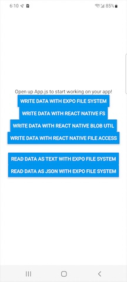

# React Native Filesystem Libraries Comparison

## Test Setup
A ~5 MB file is written 10 times to disk on every button press.

## Results
Benchmark of various React Native filesystem libraries:

## iOS Simulator on an M1 Macbook Pro, running macOS 12.4 (21F79)
```
| library                  | milliseconds, median (aka p50) |
|--------------------------+--------------------------------|
| expo-file-system         |                             28 |
| react-native-fs          |                            228 |
| react-native-blob-util   |                             31 |
| react-native-file-access |                             24 |
```
(lower is better)

## Samsung Galaxy S21 (SG-G991U), Android 12
```
| library                  | milliseconds, median (aka p50) |
|--------------------------+--------------------------------|
| expo-file-system         |                             25 |
| react-native-fs          |                            300 |
| react-native-blob-util   |                             25 |
| react-native-file-access |                             32 |
```
(lower is better)

## Conclusion
`react-native-fs` is a mature filesystem library that is well maintained, however their choice to encode everything as base64 in transit between native and JS means it comes with a huge performance hit that (to my knowledge) cannot easily be worked around. The API itself will always encode as base64 despite choosing utf-8.

# React Native Engine Benchmark: Hermes vs JSC

## Samsung Galaxy S21 (SG-G991U), Android 12
```
| Engine                  | Method                 | Result |
|-------------------------+------------------------+--------|
| Hermes                  | readExfs median        |   65.0 |
| Hermes                  | readExfs avg           |   62.2 |
| JSC                     | readExfs median        |   86.0 |
| JSC                     | readExfs avg           |   84.4 |
| Hermes                  | readExfsJson median    |  172.0 |
| Hermes                  | readExfsJson avg       |  176.2 |
| JSC                     | readExfsJson median    |  122.0 |
| JSC                     | readExfsJson avg       |  120.4 |
```
(lower is better)

## Test Setup
Built using "release" build variant in Android Studio. App was "run", not debugged. Logcat output was observed for the console.log output statements using the filter "ReactNativeJS" in verbose mode.  
To switch between the engines, simply modify `android/gradle.properties`'s `expo.jsEngine=jsc` line to whichever engine you want to test (`hermes` or `jsc`).

`readExfs()` will read data from disk as a string and discard it.  
`readExfsJson()` will read data from disk as a string, run it through `JSON.parse()` and discard it.

## Conclusion
Hermes improves app startup speed (confirmed separately) and these tests show that Hermes also reads raw data from disk a little faster than JSC (26% faster).  
JSC wins out in JSON parsing (30% faster), a very common use case for modern apps.  

So, "is Hermes faster"? If you use redux-persist or otherwise read/write JSON data frequently, the answer is likely no. If you don't, you should be fine and Hermes should be an overall win.
